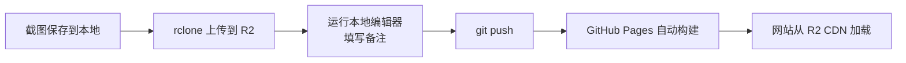

# 🎮 FUN 页面 — 游戏截图管理操作手册

> 本博客 FUN 页面用于展示游戏截图，支持轮播展示、图库检索、四段式备注（搭配码/镜头参数/主题词/自定义备注）。
>
> 截图存储在 **Cloudflare R2**（免费 CDN），备注存储在 `_data/notes.yml`，仓库仅存文本，几乎零体积。

---

## 📋 目录

- [快速工作流](#快速工作流)
- [第一次使用：一次性设置](#第一次使用一次性设置)
- [日常操作：添加新截图](#日常操作添加新截图)
- [本地编辑器使用说明](#本地编辑器使用说明)
- [直接编辑 YAML 文件](#直接编辑-yaml-文件)
- [页面功能说明](#页面功能说明)
- [常见问题](#常见问题)

---

## 快速工作流



**一句话**：截图传 R2 → 编辑器写备注 → git push 完事。

---

## 第一次使用：一次性设置

### 1. 注册 Cloudflare R2

1. 访问 [cloudflare.com](https://cloudflare.com) 注册免费账号
2. 进入控制台 → **R2** → 创建存储桶（Bucket）
   - 名称：`game-screenshots`（可自定义）
   - 位置：自动
3. 存储桶设置 → **公开访问** → 允许公开访问
4. 复制**公开 URL**，格式如：
   ```
   https://pub-xxxxxxxxxxxxxxxxxxxxxxxxxxxxx.r2.dev
   ```

### 2. 获取 API 凭证

1. R2 页面 → **管理 API 令牌** → 创建令牌
2. 权限：**管理员读写**（允许读、写、列出）
3. 保存好以下信息：
   - `Access Key ID`
   - `Secret Access Key`
   - `Endpoint URL`（格式如 `https://xxxxxxxxxxxxxxxxxxxxxxxxxxxxxxxxx.r2.cloudflarestorage.com`）

### 3. 安装 rclone

```bash
winget install Rclone
```

验证安装：

```bash
rclone version
```

### 4. 配置 rclone 连接 R2

```bash
rclone config
```

交互式配置流程：

```
n) 新建远程
   name: r2
   Storage: 4 (Amazon S3 Compatible Storage)
   provider: Cloudflare
   access_key_id: 粘贴你的 Access Key ID
   secret_access_key: 粘贴你的 Secret Access Key
   endpoint: 粘贴你的 Endpoint URL
   acl: public-read
   Edit advanced config: n
   Keep this remote: y
q) 退出
```

验证连接：

```bash
rclone ls r2:game-screenshots
```

### 5. 创建游戏目录

```bash
rclone mkdir r2:game-screenshots/nikki
rclone mkdir r2:game-screenshots/ff14
```

### 6. 配置编辑器

编辑 `tools/notes-editor/config.json`：

```json
{
  "rcloneRemote": "r2",
  "rcloneBucket": "game-screenshots",
  "publicUrlPrefix": "https://pub-你的ID.r2.dev",
  "games": ["nikki", "ff14"]
}
```

> `publicUrlPrefix` 填你在 **步骤 1** 中复制的 R2 公开 URL。

---

## 日常操作：添加新截图

### 完整流程（约 2 分钟）

```bash
# 1️⃣ 上传截图到 R2
rclone copy /d/我的截图/ r2:game-screenshots/nikki/ --progress

# 2️⃣ 启动本地备注编辑器
node tools/notes-editor/server.js

# 3️⃣ 浏览器自动打开 → 填写备注 → 点击「保存到 YAML」

# 4️⃣ 提交到 GitHub
git add _data/notes.yml
git commit -m "添加新截图备注"
git push
```

### 结果

- ✅ 截图从全球 CDN 加速加载
- ✅ 仓库体积几乎不变（只存了文本）
- ✅ 网站自动更新

---

## 本地编辑器使用说明

### 启动

```bash
node tools/notes-editor/server.js
```

输出示例：

```
🎮 游戏截图备注编辑器

📋 检查环境...
✅ rclone 已就绪

🔍 扫描 R2 (r2:game-screenshots)...
   发现 5 张截图
   nikki/: 3 张
   ff14/: 2 张

📖 读取 _data/notes.yml...
   已有 2 条备注

🚀 编辑器已启动: http://localhost:3456
```

### 界面功能

| 功能 | 说明 |
|------|------|
| **游戏标签** | 顶部标签切换 Nikki / FF14 |
| **图片网格** | 所有截图缩略图，自动从 R2 加载 |
| **备注字段** | 每张图 4 个输入框 |
| **保存按钮** | 右上角「保存到 YAML」或 `Ctrl+S` |
| **保存提示** | 绿色提示条表示保存成功 |

### 备注字段说明

| 字段 | 标签 | 示例 |
|------|------|------|
| 搭配码 | 🎀 搭配码 | `ABC-123` |
| 镜头参数 | 📷 镜头参数 | `f/1.8, 1/250s, ISO 100` |
| 主题词 | 🏷️ 主题词 | `优雅, 人像, 花朵` |
| 自定义备注 | 📝 自定义备注 | `新年第一拍，搭配了新春套装` |

### 保存后

编辑器会自动写入 `_data/notes.yml`，你只需执行 `git push` 即可。

---

## 直接编辑 YAML 文件

如果你不想启动编辑器，也可以直接编辑 `_data/notes.yml`：

```yaml
# _data/notes.yml

# 格式：游戏名 -> 图片文件名 -> 字段
nikki:
  "2025-01-01_portrait.jpg":
    src: "https://pub-xxxxx.r2.dev/nikki/2025-01-01_portrait.jpg"
    outfitCode: "ABC-123"
    cameraParams: "f/1.8, 1/250s, ISO 100"
    themeWords: "优雅, 人像, 花朵"
    customNotes: "新年第一拍，搭配了新春套装"

  "photo_without_url.jpg":
    # 不写 src 则从本地 img/games/nikki/ 加载
    outfitCode: "XYZ-789"
    cameraParams: ""
    themeWords: ""
    customNotes: ""
```

### 字段说明

| 字段 | 必填 | 说明 |
|------|------|------|
| `src` | 否 | 图片 URL（R2 地址），不填则从本地 `img/games/` 加载 |
| `outfitCode` | 否 | 搭配码，默认为 null |
| `cameraParams` | 否 | 镜头参数，默认为 null |
| `themeWords` | 否 | 主题词，默认为 null |
| `customNotes` | 否 | 自定义备注，默认为空字符串 |

### 图片加载优先级

| 优先级 | 来源 | 路径 |
|--------|------|------|
| 1（最高） | `_data/notes.yml` 中的 `src` 字段 | R2 CDN URL |
| 2 | `_data/notes.yml` 中无 `src` 字段 | `img/games/{游戏}/{文件名}` |
| 3（回退） | `site.static_files` 自动发现 | `img/games/{游戏}/{文件名}` |

---

## 页面功能说明

FUN 页面（`fun.html`）包含两个部分：

### 第一部分：轮播

- 自动轮播当前游戏的所有截图
- **每张 1.5 秒**自动切换
- 底部圆点可点击跳转
- 左右箭头 / 键盘 ← → 键控制
- 鼠标悬停暂停轮播

### 第二部分：图库与备注

- 网格展示所有截图
- 每张卡片显示 4 个备注字段（可编辑）
- 搜索框：实时过滤所有备注字段内容
- 点击图片大图预览
- 备注编辑保存在浏览器 localStorage（覆盖层），与 YAML 文件数据合并显示

---

## 常见问题

### Q: 不想要 R2，只用本地图片可以吗？

可以。`_data/notes.yml` 中不写 `src` 字段即可，图片会自动从 `img/games/{游戏名}/` 加载。

### Q: 如何添加新游戏？

**方法一：用编辑器**
在编辑器界面点击「+ 添加游戏」，输入名称即可。

**方法二：手动**
1. 在 `tools/notes-editor/config.json` 的 `games` 数组中添加游戏名
2. 创建 R2 目录：`rclone mkdir r2:game-screenshots/新游戏名`
3. 上传截图
4. 运行编辑器，自动识别

### Q: 如何修改已有备注？

两种方式：
1. **运行编辑器**：`node tools/notes-editor/server.js`，可视化编辑后保存
2. **直接编辑**：修改 `_data/notes.yml` 后提交

### Q: 工具报「rclone not found」？

```bash
winget install Rclone
```

安装后重启终端。

### Q: 工具报「rclone 连接失败」？

检查 `tools/notes-editor/config.json` 中的配置是否正确，或重新运行 `rclone config` 配置 R2。

### Q: 保存后网站没有更新？

GitHub Pages 构建需要 1-2 分钟，请稍后刷新。确认已执行 `git push`。

### Q: 备注数据存在哪里？

| 存储位置 | 用途 | 持久性 |
|----------|------|--------|
| `_data/notes.yml` | 数据源（永久存储） | 提交到 GitHub 后永久保存 |
| 浏览器 localStorage | 临时覆盖层 | 仅当前浏览器有效 |

---

## 文件清单

| 文件 | 说明 |
|------|------|
| `fun.html` | FUN 页面（轮播 + 图库 + 备注） |
| `_data/notes.yml` | 截图备注数据文件 |
| `tools/notes-editor/server.js` | 本地可视化备注编辑器 |
| `tools/notes-editor/config.json` | 编辑器配置（R2 地址等） |
| `img/games/nikki/` | Nikki 截图本地目录（回退方案） |
| `img/games/ff14/` | FF14 截图本地目录（回退方案） |