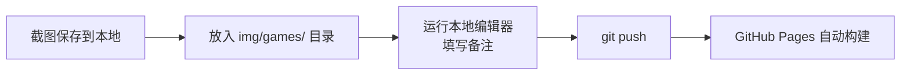

# 🎮 FUN 页面 — 游戏截图管理操作手册

> 本博客 FUN 页面用于展示游戏截图，支持轮播展示、图库检索、四段式备注（搭配码/镜头参数/主题词/自定义备注）。
>
> 截图存储在 `img/games/` 目录的本地文件，备注存储在 `_data/notes.yml`，仓库仅存文本。

---

## 📋 目录

- [快速工作流](#快速工作流)
- [日常操作：添加新截图](#日常操作添加新截图)
- [本地编辑器使用说明](#本地编辑器使用说明)
- [直接编辑 YAML 文件](#直接编辑-yaml-文件)
- [页面功能说明](#页面功能说明)
- [常见问题](#常见问题)

---

## 快速工作流



**一句话**：截图放入目录 → 编辑器写备注 → git push 完事。

---

## 日常操作：添加新截图

### 完整流程（约 1 分钟）

```bash
# 1️⃣ 把截图放入对应游戏的文件夹
#     img/games/nikki/  或  img/games/ff14/

# 2️⃣ 启动本地备注编辑器
node tools/notes-editor/server.js

# 3️⃣ 浏览器自动打开 → 填写备注 → 点击「保存到 YAML」

# 4️⃣ 提交到 GitHub
git add img/games/ _data/notes.yml
git commit -m "添加新截图备注"
git push
```

### 结果

- ✅ 截图从 GitHub Pages 服务器加载
- ✅ 仓库存储截图和备注
- ✅ 网站自动更新

---

## 本地编辑器使用说明

### 启动

```bash
node tools/notes-editor/server.js
```

输出示例：

```
🎮 游戏截图备注编辑器

🔍 扫描本地目录 img/games/...
   nikki/: 20 张
   ff14/: 1 张
   共发现 21 张截图

📖 读取 _data/notes.yml...
   已有 21 条备注

🚀 编辑器已启动: http://localhost:3456
```

### 界面功能

| 功能 | 说明 |
|------|------|
| **游戏标签** | 顶部标签切换 Nikki / FF14 |
| **图片网格** | 所有截图缩略图，从本地加载 |
| **备注字段** | 每张图 4 个输入框 |
| **保存按钮** | 右上角「保存到 YAML」或 `Ctrl+S` |
| **保存提示** | 绿色提示条表示保存成功 |

### 备注字段说明

| 字段 | 标签 | 示例 |
|------|------|------|
| 搭配码 | 🎀 搭配码 | `ABC-123` |
| 镜头参数 | 📷 镜头参数 | `f/1.8, 1/250s, ISO 100` |
| 主题词 | 🏷️ 主题词 | `优雅, 人像, 花朵` |
| 自定义备注 | 📝 自定义备注 | `新年第一拍，搭配了新春套装` |

### 保存后

编辑器会自动写入 `_data/notes.yml`，你只需执行 `git push` 即可。

---

## 直接编辑 YAML 文件

如果你不想启动编辑器，也可以直接编辑 `_data/notes.yml`：

```yaml
# _data/notes.yml

# 格式：游戏名 -> 图片文件名 -> 字段
nikki:
  "2025-01-01_portrait.jpg":
    outfitCode: "ABC-123"
    cameraParams: "f/1.8, 1/250s, ISO 100"
    themeWords: "优雅, 人像, 花朵"
    customNotes: "新年第一拍，搭配了新春套装"
```

### 字段说明

| 字段 | 必填 | 说明 |
|------|------|------|
| `outfitCode` | 否 | 搭配码，默认为 null |
| `cameraParams` | 否 | 镜头参数，默认为 null |
| `themeWords` | 否 | 主题词，默认为 null |
| `customNotes` | 否 | 自定义备注，默认为空字符串 |

### 图片加载来源

图片从本地 `img/games/{游戏名}/{文件名}` 路径加载，只需将截图放入对应文件夹即可。

---

## 页面功能说明

FUN 页面（`fun.html`）包含两个部分：

### 第一部分：轮播

- 自动轮播当前游戏的所有截图
- **每张 1.5 秒**自动切换
- 底部圆点可点击跳转
- 左右箭头 / 键盘 ← → 键控制
- 鼠标悬停暂停轮播

### 第二部分：图库与备注

- 网格展示所有截图
- 每张卡片显示 4 个备注字段（可编辑）
- 搜索框：实时过滤所有备注字段内容
- 点击图片大图预览
- 备注编辑保存在浏览器 localStorage（覆盖层），与 YAML 文件数据合并显示

---

## 常见问题

### Q: 如何添加新游戏？

**方法一：用编辑器**
在编辑器界面点击「+ 添加游戏」，输入名称即可。

**方法二：手动**
1. 在 `tools/notes-editor/config.json` 的 `games` 数组中添加游戏名
2. 在 `img/games/` 下创建对应文件夹
3. 放入截图
4. 运行编辑器，自动识别

### Q: 如何修改已有备注？

两种方式：
1. **运行编辑器**：`node tools/notes-editor/server.js`，可视化编辑后保存
2. **直接编辑**：修改 `_data/notes.yml` 后提交

### Q: 保存后网站没有更新？

GitHub Pages 构建需要 1-2 分钟，请稍后刷新。确认已执行 `git push`。

### Q: 备注数据存在哪里？

| 存储位置 | 用途 | 持久性 |
|----------|------|--------|
| `_data/notes.yml` | 数据源（永久存储） | 提交到 GitHub 后永久保存 |
| 浏览器 localStorage | 临时覆盖层 | 仅当前浏览器有效 |

---

## 文件清单

| 文件 | 说明 |
|------|------|
| `fun.html` | FUN 页面（轮播 + 图库 + 备注） |
| `_data/notes.yml` | 截图备注数据文件 |
| `tools/notes-editor/server.js` | 本地可视化备注编辑器 |
| `tools/notes-editor/config.json` | 编辑器配置 |
| `img/games/nikki/` | Nikki 截图本地目录 |
| `img/games/ff14/` | FF14 截图本地目录 |